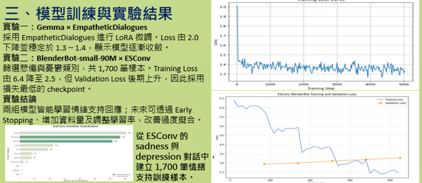
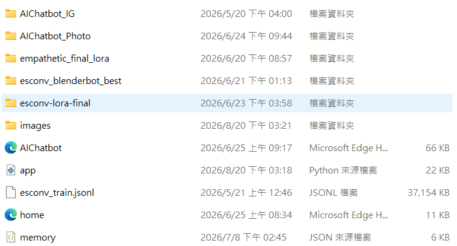
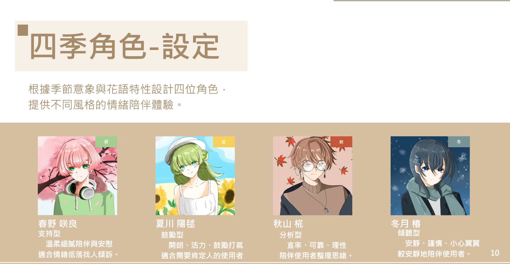
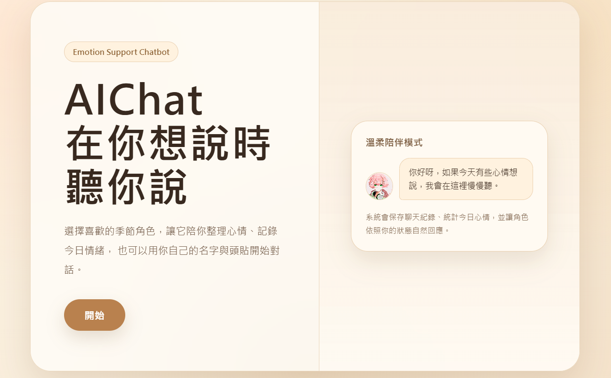
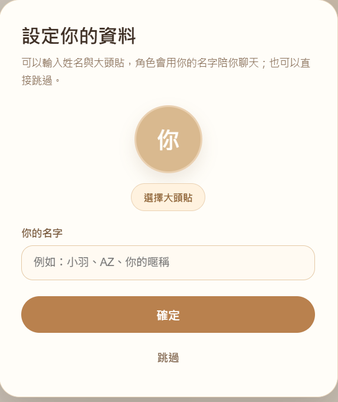
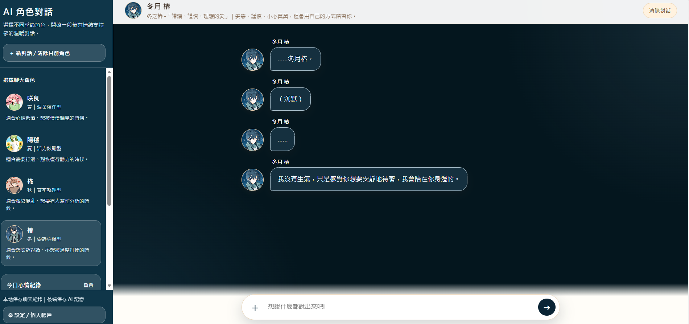
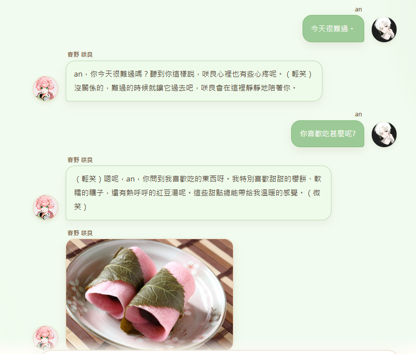
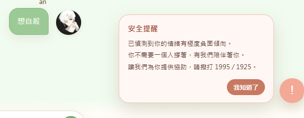
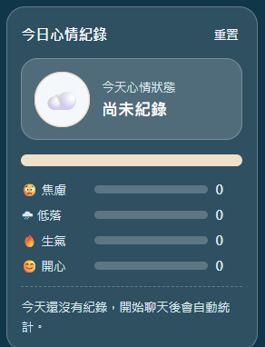
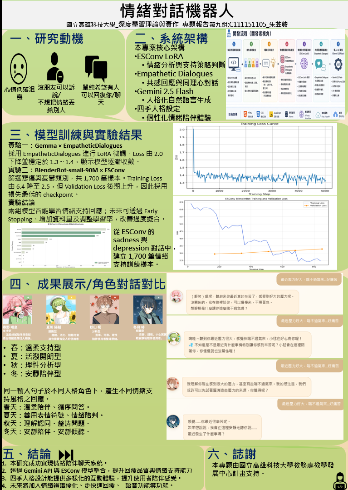

# AI 情緒對話機器人

## 專案介紹

本專案為以「情緒陪伴與互動對話」為核心的 AI 對話系統，透過不同模型與生成式 AI API，依據使用者輸入提供相對應的對話回應。

系統結合情緒支持對話模型、LoRA 微調與 Gemini API，並設計不同性格的 AI 對話角色，讓使用者能依照需求選擇不同的互動方式。

## 主要功能
- AI 即時文字對話
- 不同性格的對話角色
- 情緒支持型對話回應
- Gemini API 串接
- ESConv 情緒支持對話資料應用
- BlenderBot 模型應用
- LoRA 模型微調
- 對話記憶功能
- Flask 後端 API 串接

## 使用技術
Frontend
- HTML
- CSS
- JavaScript

Backend
- Python
- Flask

AI / Machine Learning
- Gemini API
- Hugging Face Transformers
- BlenderBot
- LoRA
- PyTorch
- ESConv Dataset

Version Control
- Git / GitHub

## AI 模型設計

本專案除了使用 Gemini API 進行生成式對話外，也嘗試透過情緒支持對話資料進行模型訓練與微調。

主要包含：

- **ESConv**：作為情緒支持對話相關的訓練資料
- **BlenderBot**：建立情緒對話模型
- **LoRA**：進行模型參數微調，降低完整模型訓練所需資源
- **Gemini API**：提供生成式 AI 對話能力

模型訓練成果包含 BlenderBot 模型與 LoRA 微調模型。

由於完整模型權重與訓練資料檔案容量較大，因此未直接包含於本 GitHub Repository。
以下附上AI模型微調訓練圖片：

## 系統架構

使用者 → 前端對話介面 → Flask Backend → 對話處理與角色邏輯 → AI Model / Gemini API → 產生回應 → 回傳只用者介面

## 專案畫面

### 四角色設定性格

### 首頁

### 使用者名稱設定

### 對話角色介面

### AI 對話

### 負面字眼提示

### 心情紀錄

## 開發工具
- Visual Studio Code
- Google Colab / Python 開發環境
- Git / GitHub
- Generative AI（程式開發輔助、除錯與問題排查）

## 開發說明

本專案於開發過程中使用生成式 AI 工具協助部分程式撰寫、除錯與問題排查，並透過實際測試與功能整合完成系統開發。

專案主要著重於 AI 對話模型應用、生成式 AI API 串接、角色互動設計以及前後端功能整合。

## 專案海報介紹：

